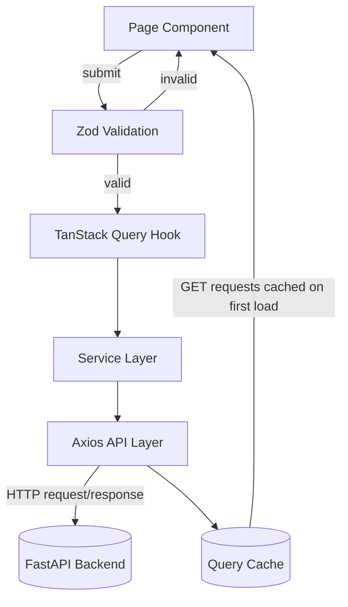

# SiteSync — Construction Site Management Dashboard

🔗 **[Live Demo](https://getsitesync.vercel.app)** · 🎬 **[Demo Video](https://drive.google.com/file/d/1l8umfMvtsFmqvmx9zrP3nbgHdjgkLYcd/view?usp=drive_link)** · 💻 **[Backend Repo](https://github.com/edrian-a-marinas/sitesync-api)**

---

## What It Does

Managing construction sites from a spreadsheet means switching tabs, scrolling through rows, and hoping nothing's out of date. SiteSync's frontend turns that into a single, role-aware dashboard — owners see live budget and workforce KPIs across every project, managers log daily site activity in a few clicks, and workers check in from the field, all backed by real-time data and clean, responsive UI.

---

## Key Features (Frontend)

- **Role-based routing** — separate views and navigation per role (Owner, PM, Site Worker), enforced at route level.
- **Validation** — Zod validates all form inputs before any request is sent, preventing unnecessary backend calls.
- **Live dashboards** — role-aware KPI cards, budget charts, and project health tables.
- **Smart data fetching** — TanStack Query for caching, pagination, and auto-invalidation on mutations.
- **Global auth state** — Zustand store with silent session restore and auto-logout on token expiry.
- **Accessible UI kit** — Radix UI + Tailwind CSS components (dialogs, dropdowns, tabs, tooltips).
- **Skeleton loading states** — structured placeholders instead of blank screens or spinners.
- **Toast notifications** — Sonner-powered feedback for actions and errors.
- **Demo mode** — one-click role-based login for quick recruiter/reviewer access.

---

## Architecture Overview



---

## Tech Stack

| Layer       | Technology                                                                                                            |
| ----------- | --------------------------------------------------------------------------------------------------------------------- |
| Backend     | Python, FastAPI, PostgreSQL, SQLAlchemy, Alembic, asyncio, Pytest, SlowAPI                                            |
| Frontend    | React, TypeScript, TanStack (Router, Table), Zod, Zustand, Axios, Radix UI, TailwindCSS                               |
| AI / ML     | RAG, GroqAPI, scikit-learn, RandomForest — training, forecasting, and prediction (2 year seeded datas)                |
| Security    | JWT, Role-based dependencies endpoints, Rate limiting, CORS, secrets credentials management, ORM-protected SQL, HTTPS |
| Performance | Redis (cache + broker), Celery/Beat, end-to-end pagination, Tanstack Query cache, database indexes                    |
| Deployment  | AWS (EC2, RDS, S3, ECS), Docker, Caddy (reverse proxy + auto SSL), Vercel, GitHub Actions                             |

---

## Structure & Data Flow

- **Architecture**: Layered structure — `pages → hooks → services → api → validations/types`
- **Routing**: TanStack Router with route-level guards (`ProtectedRoute`, `PublicRoute`) and typed search params
- **Validation**: Zod schemas validate all form inputs client-side before any request is sent
- **Data fetching**: TanStack Query per-domain hooks (e.g. `useDailyLog`) manage caching, loading, and error state
- **API layer**: Centralized Axios instance with request/response interceptors (auth token injection, 401 auto-logout)
- **State management**: Zustand for global auth state, persisted across route changes
- **Type safety**: Shared TypeScript types per domain, inferred from Zod schemas where possible
- **Code quality**: Enforced via ESLint + Prettier

---

## Local Setup

### Prerequisites

- Docker & Docker Compose
- Bun (or Node.js) for the frontend

### Backend

1. Clone the repo and navigate into it

```bash
git clone https://github.com/edrian-a-marinas/sitesync-api.git
cd sitesync-api
```

2. Copy the environment template and fill in your values

```bash
cp .env.example .env
```

#### Option 1 — Docker (recommended)

Start all services (API, PostgreSQL, Redis, Celery worker, Celery beat)

```bash
docker compose up --build
```

Migrations run automatically on container start. API available at `http://localhost:8000/docs`

#### Option 2 — Local Python environment

Useful for active development with live reload.

```bash
python -m venv venv && source venv/bin/activate   # venv\Scripts\activate on Windows
pip install -r requirements.txt
alembic upgrade head
uvicorn app.main:app --reload
```

Run Celery worker and beat in separate terminals (same venv):

```bash
celery -A app.core.celery.celery_app worker --loglevel=info
celery -A app.core.celery.celery_app beat --loglevel=info
```

### Frontend

1. Clone the repo and navigate into it

```bash
git clone https://github.com/edrian-a-marinas/sitesync-client.git
cd sitesync-client
```

2. Install dependencies

```bash
bun install
```

3. Copy the environment template and fill in your values

```bash
cp .env.example .env.local
```

4. Start the dev server

```bash
bun run dev
```

5. App available at `http://localhost:5173`

---

## Congrats, App Running! 🎉

Make sure if logging in as PM / Owner, use the link:
`http://localhost:5173/login/admin`

**Owner:**

```
seed.owner@sitesync.com
test1234
```

**PM:**

```
seed.pm2@sitesync.com
test1234
```

**Worker:**

```
seed.worker3@sitesync.com
test1234
```

Or you can just use the **Demo Sign In** (read-only).

> **Reference:** Logging in as PM/Owner in `/login/` will fail, and vice versa with Worker.

_Built by Edrian Mariñas — 2026_
